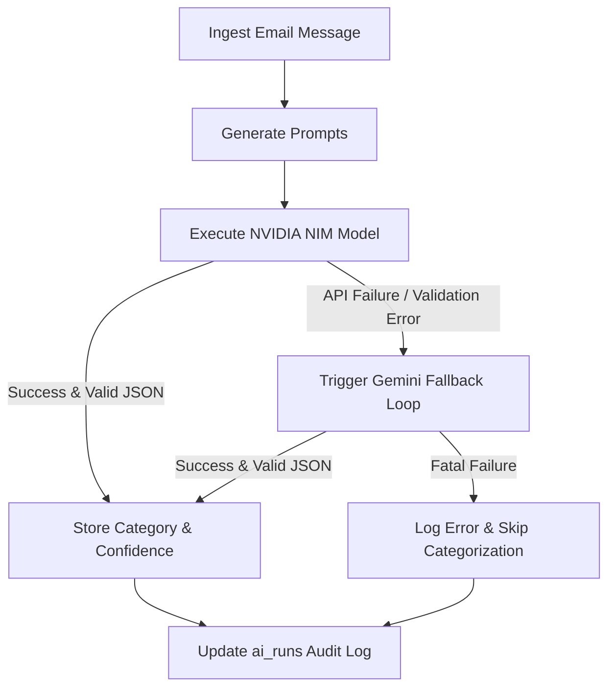

# Architecture & Design Document

## 1. System Architecture
The platform is designed around a three-tier model engineered to support secure, multi-tenant agent execution:
- **Frontend Console:** A React (Vite) single-page application that serves as the human-in-the-loop review boundary, enabling users to manage synced emails, chat with their mailbox memory, and review/edit AI drafts.
- **Agent Control Plane & Action State Engine:** A Node.js + Express API acting as the central orchestrator. It manages user sessions, refreshes Google OAuth tokens, coordinates RAG pipelines, and handles state verification for all external and internal actions.
- **Semantic Memory Bank:** Supabase PostgreSQL with the `pgvector` extension. It stores relational state (users, messages, threads, labels, sync logs) side-by-side with high-dimensional vector representations of parsed email content.
- **Custom Agent Skill & Tool Ecosystem:**
  - **Gmail API wrapper:** Exposes capabilities to read labels, retrieve message bodies, and build/save draft responses.
  - **Google Gemini API (Primary Model):** Powers RAG response generation, email and thread summarization, draft composing, and fallback classification.
  - **NVIDIA NIM API (Secondary Model):** Fast, specialized model engine (`eta/llama-3.1-8b-instruct`) utilized for structured email classification tasks.

### Multi-Model Graph Orchestration Loop
To balance latency, cost, and classification accuracy, email categorization is implemented as a multi-model orchestration graph:

1. Upon email ingestion, the control plane constructs a structured categorization prompt.
2. The agent attempts to classify the email using the fast **NVIDIA NIM** endpoint (`eta/llama-3.1-8b-instruct`) with a strict JSON format response directive.
3. If the NIM call fails (due to connection timeouts, rate limits, or malformed JSON payloads), the control plane automatically catches the exception and routes the prompt to **Google Gemini** (`gemini-2.5-flash`) as an inline fallback loop.
4. Telemetry (latency, success status, models used, and exceptions) is logged directly into the `ai_runs` table.

---

## 2. Database Schema & Memory Storage
We rely on a normalized PostgreSQL schema provided via Supabase to store hierarchical email metadata. 

### Multi-Tenant Data Isolation
A major security risk in agentic platforms is cross-tenant data leakage. We address this at the database and query layers:
- **Service-Scoped Queries:** The Express backend interacts with Supabase using the service role key. To prevent one user from accessing another's email context, every single database query (including vector queries) enforces strict programmatic isolation using `.eq('user_id', userId)`.
- **Schema Constraints:** Tables like `email_messages`, `email_threads`, and `email_embeddings` utilize composite keys and foreign keys referencing the central `users(id)` table with `ON DELETE CASCADE` constraints.
- **Vector Isolation:** Embedding queries pass the authenticated user's ID directly into the PostgreSQL RPC function, ensuring vector comparison is strictly bounded.

---

## 3. AI Design & RAG Pipeline

### Summarization Loops
- **Email Summarization:** Distills individual message bodies using Gemini to extract sender intent, required action, urgency metrics, and entities.
- **Thread Summarization:** Chronologically aggregates all messages in a thread, chunking the content if it exceeds token limits. Captures the overall conversation arc, open questions, and next steps.

### Semantic RAG Search & Hallucination Prevention
The platform's chat agent queries the synced email history using a source-grounded Retrieval-Augmented Generation (RAG) pipeline:
1. **Query Embedding:** The user's query is embedded using `gemini-embedding-001`, producing a 768-dimensional float array.
2. **pgvector Similarity Search:** The backend calls the PostgreSQL database function `match_email_embeddings`. It performs a cosine distance similarity match (`<=>`), filtered strictly by the user's validated ID:
   ```sql
   1 - (embedding <=> query_embedding) AS similarity
   ```
3. **Threshold Filtering:** Results with a similarity score of `0.1` or lower are immediately discarded to exclude irrelevant noise.
4. **Context Construction:** The control plane aggregates the top-scoring text chunks alongside metadata (Sender, Subject, Date, Gmail Message/Thread IDs) and compiles them into a structured context window.
5. **Zero-Hallucination Prompting:** The prompt injected into Gemini enforces strict grounding:
   - The model must answer *only* using the provided email context.
   - It is strictly forbidden from using pre-trained external knowledge.
   - If the context is insufficient, it must return `"I could not find this information in the synced emails."` and set `not_found: true` in the JSON response.
   - It must return a structured JSON response containing the answer and an array of source objects mapping the exact emails utilized.

---

## 4. Gmail API & Tooling Strategy
- **Least Privilege Scopes:** We restrict Google OAuth scopes to `gmail.readonly` for ingestion and `gmail.send` / `gmail.compose` for replies, preventing unnecessary access.
- **Quota & Rate Limit Mitigation:** All outgoing Google and LLM network requests run through a `withRetry` utility that uses exponential backoff scaling (`baseDelayMs * 2^attempt`) and randomized additive jitter to handle API rate limiting (`429` statuses).
- **Draft-First Response Safety:** To prevent the AI from autonomously sending incorrect or unsafe emails, the agent never dispatches replies directly. It creates a **Draft** in the user's Gmail box. The user must review, edit, and click the explicit "Send" button on the React console to trigger transmission.

---

## 5. Agent Security & Threat Modeling Matrix
To satisfy the day 4 Kaggle Agent security requirements, the platform implements a proactive, shift-left security architecture mapping the STRIDE threat matrix:

| STRIDE Threat Category | Potential Risk Vector | Platform Mitigation Architecture | Implementation details |
| :--- | :--- | :--- | :--- |
| **S**poofing | Attacker spoofs session details to access another user's mailbox. | Signed HTTP-Only Cookies + JWT validation. | Sessions are stored in JWT tokens signed with a 256-bit secret, delivered via HTTP-Only SameSite cookies. Frontend scripts cannot access session state. |
| **T**ampering | User modifies parameter IDs to read another user's email messages or embeddings. | Database-level and API-level User ID scoping. | The backend ignores client-supplied user identifiers. The active user ID is extracted directly from the verified JWT payload and applied to all DB queries. |
| **R**epudiation | User claims they did not sync emails or authorize draft generations. | Non-repudiable audit logs and AI runs history. | Telemetry logs write metadata to `audit_events` and token/latency values to `ai_runs` on all critical API and LLM transitions. |
| **I**nformation Disclosure | Google OAuth access/refresh tokens or sensitive emails leak to logs or the client. | Backend-only token storage and log sanitization. | Google credentials remain strictly in the server-side `gmail_accounts` table. Access tokens are refreshed server-to-server and are never logged or sent to the client. |
| **D**enial of Service | API limit exhaustion or server crash from excessive sync runs. | Exponential backoff retry logic and sync volume limits. | All Gmail API and AI fetches run through the `withRetry` utility with backoff jitter, and synchronizations are capped to a max of 50/100 messages. |
| **E**levation of Privilege | Attacker accesses administrative features or protected routes. | Centralized Route Middleware Guardrails. | Every action route (syncing, RAG querying, drafting replies) is protected by the `requireAuth` Express middleware to reject unauthorized calls. |

---

## 6. Trade-offs & Limitations
- **In-Process Orchestration:** Sync runs execute in-process inside the Express web thread. Large inboxes may encounter sync timeouts. Production apps should use a dedicated task worker queue (e.g., BullMQ, Celery).
- **Token Encryption Simplification:** For the MVP, OAuth tokens are stored in plain text inside the backend-restricted `gmail_accounts` table. A production deployment must encrypt these using AWS KMS, GCP KMS, or Supabase Vault at rest.
- **Retrieval Scope:** RAG queries rely solely on pgvector cosine similarity. High-scale production search should combine this with full-text lexical search and cross-encoder reranking (e.g., Cohere Rerank) to improve retrieval precision.